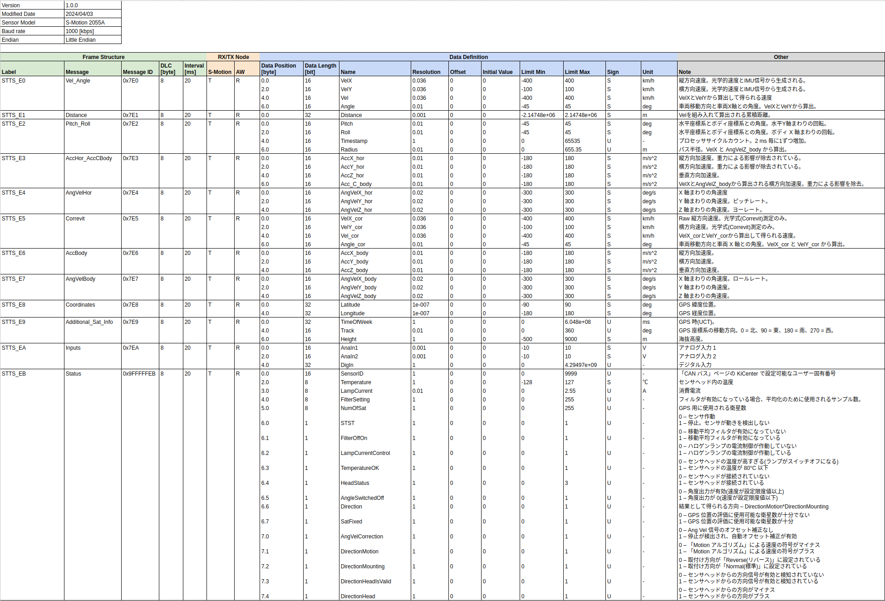

# KISTLER ROS DRIVER

This is ROS Driver for Non-contact optical sensors Correvit S-Motion DTI, standard / 2055A.

Kistler official page of 2055A(https://www.kistler.com/JP/ja/cp/non-contact-optical-sensors-correvit-s-motion-dti-2055a/P0001154)

# CAN Communication Specification

# Input and Output Topics

## Input
| Name              | Type                 | Description                    |
| ----------------- | -------------------- | ------------------------------ |
| `**/from_can_bus` | can_msgs::msg::Frame | Kistler S-Motion CAN frame     |

## Output
| Name                | Type                               | Description                  |
| ------------------- | ---------------------------------- | ---------------------------- |
| `kistler/e0_status` | kistler_driver_msgs::msg::E0Status | Vel_Angle Status             |
| `kistler/e1_status` | kistler_driver_msgs::msg::E1Status | Distance Status              |
| `kistler/e2_status` | kistler_driver_msgs::msg::E2Status | Pitch_Roll Status            |
| `kistler/e3_status` | kistler_driver_msgs::msg::E3Status | AccHor_AccCBody Status       |
| `kistler/e4_status` | kistler_driver_msgs::msg::E4Status | AngVelHor Status             |
| `kistler/e5_status` | kistler_driver_msgs::msg::E5Status | Correvit Status              |
| `kistler/e6_status` | kistler_driver_msgs::msg::E6Status | AccBody Status               |
| `kistler/e7_status` | kistler_driver_msgs::msg::E7Status | AngVelBody Status            |
| `kistler/e8_status` | kistler_driver_msgs::msg::E8Status | Coordinates Status           |
| `kistler/e9_status` | kistler_driver_msgs::msg::E9Status | Additional_Sat_Info Status   |
| `kistler/ea_status` | kistler_driver_msgs::msg::EAStatus | Input Status                 |
| `kistler/eb_status` | kistler_driver_msgs::msg::EBStatus | Sensor Status                |